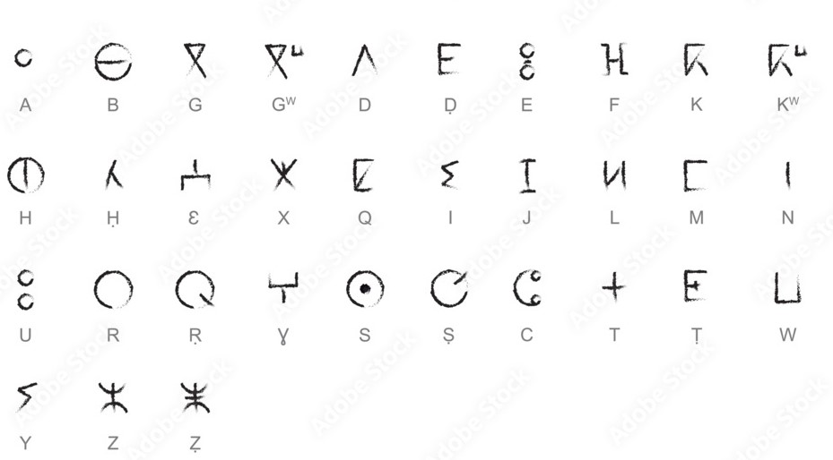

# Tifinagh Character Recognition Project

his project aims to develop a Convolutional Neural Network (CNN) model to classify Tifinagh characters using the Tifinagh-MNIST and tifinaghdataset dataset. Tifinagh is the script used to write the Amazigh language, and this project focuses on recognizing and classifying its characters using deep learning techniques.


## Project Overview

The project involves preprocessing the Tifinagh-MNIST dataset, building and training a CNN model, and evaluating its performance. The model is designed to recognize and classify Tifinagh characters with high accuracy. The project is structured to ensure modularity, reproducibility, and ease of use.

## Project Structure
```
Tifinagh-CNN/
├── data/
│   ├── tifinaghdataset/        # Raw data files
│   ├── Tifinagh-MNIST/   # Raw data files
│   └── metadata/     # Metadata files
├── models/           # Trained models
├── notebooks/        # Jupyter notebooks for exploration
├── scripts/          # Utility scripts
├── src/              # Source code for the application
├── tests/            # Test files
├── logs/             # Log files
├── myenv/            # Virtual environment
├── characters.txt    # Character mappings or labels
├── requirements.txt  # Python dependencies
└── README.md         # Project documentation
```

## Installation

1. Clone the repository:
   ```bash
   git clone https://github.com/yourusername/Tifinagh-MNIST.git
   cd Tifinagh-MNIST
   ```

2. Set up a virtual environment and activate it:
   ```bash
   python -m venv myenv
   source myenv/bin/activate  # On Windows use `myenv\Scripts\activate`
   ```

3. Install the required dependencies:
   ```bash
   pip install -r requirements.txt
   ```

## Usage

1. Ensure your dataset is placed in the `data/Tifinagh-MNIST/` directory.

2. Update the `metadata/tifinagh_dataset.csv` file with the correct paths to your images.

3. Run the model training script:
   ```bash
   python src/model.py
   ```

## Model Architecture

The model architecture is defined as follows:
```python
from tensorflow.keras.models import Sequential
from tensorflow.keras.layers import Conv2D, MaxPooling2D, Flatten, Dense, Dropout

model = Sequential([
    Conv2D(32, (3, 3), activation='relu', input_shape=(64, 64, 1)),
    MaxPooling2D((2, 2)),
    Conv2D(64, (3, 3), activation='relu'),
    MaxPooling2D((2, 2)),
    Conv2D(128, (3, 3), activation='relu'),
    MaxPooling2D((2, 2)),
    Flatten(),
    Dense(128, activation='relu'),
    Dropout(0.5),
    Dense(num_classes, activation='softmax')
])
```

## Training

The model is trained for 20 epochs with a batch size of 32. Training and validation accuracy and loss metrics are logged during the process.

## Saving the Model

The trained model is saved as `tifinagh_model342.h5` in the `models/` directory.

## Contributing

Contributions are welcome! Please fork the repository and create a pull request with your changes.

## License

This project is licensed under the MIT License. See the `LICENSE` file for details.
